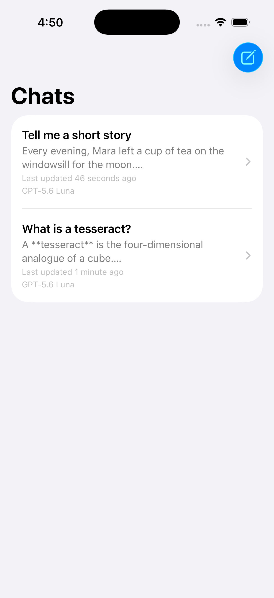
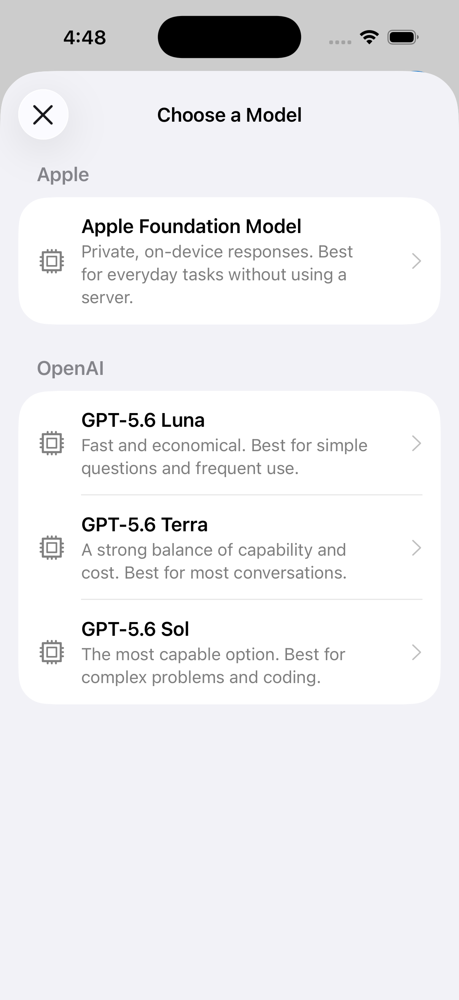

# ChatLLM

ChatLLM is a personal iOS project built to gain more hands-on experience with
Apple's Foundation Models framework and LLMs from other providers. It's a
practical place to experiment, compare models, and try out new ideas—not a
production app.

The idea is pretty simple: one chat interface that can talk to both on-device
and hosted models, with all the provider-specific plumbing tucked out of sight.

## Screenshots

<p align="center">
  
  
  
</p>

## Features

- Chat with Apple's on-device Foundation Model on supported devices.
- Chat with supported OpenAI models through a Supabase Edge Function.
- Choose models grouped by provider, with short descriptions and availability
  information.
- Persist chat history locally and restore conversations across app launches.
- Continue multi-turn hosted conversations using opaque response identifiers.
- Surface safe backend errors and request identifiers for troubleshooting.
- Cover the client and backend contract with Swift Testing and Deno tests.

## Project Goals

- Get comfortable with Foundation Models and how availability varies across
  devices.
- Compare on-device inference with hosted LLMs.
- Explore a provider-neutral model and service architecture.
- Practice modern SwiftUI, Observation, Swift concurrency, and Swift Testing.
- Learn how to keep provider credentials out of an iOS app.

## Architecture

There are two main pieces:

- `ChatLLM/` — the SwiftUI app. Each conversation gets its own provider service
  and sticks with one model.
- `supabase/functions/` — a lightweight backend that validates the public chat
  contract, keeps provider credentials on the server, and calls the selected
  hosted model.

For hosted models, the app sends the provider, model, message, and optional
continuation ID to the backend. The backend gets the final say on which
provider and model combinations are supported.

The app stores chats and messages locally with SwiftData. It also persists the
opaque continuation IDs needed to resume hosted conversations. On-device
Foundation Models sessions are reconstructed from their saved transcripts when
the app launches again.

The full API contract lives in [docs/chat-api.md](docs/chat-api.md).

## Supported Models

The current lineup includes:

- Apple Foundation Model — private, on-device generation through Apple's
  Foundation Models framework.
- GPT-5.6 Luna — the fast and economical OpenAI option.
- GPT-5.6 Terra — the balanced OpenAI option.
- GPT-5.6 Sol — the most capable OpenAI option in the current catalog.

The OpenAI models need the ChatLLM backend to be configured. The Apple model
depends on the device supporting Apple Intelligence, having it enabled, and
the model being ready.

## Requirements

- Xcode with the iOS 26.5 SDK or newer.
- An iOS 26.5 simulator or device.
- An Apple Intelligence-capable device to use the on-device model.
- A Supabase project and OpenAI API key to use hosted OpenAI models.
- Supabase CLI and Deno when developing or testing the backend locally.

## Getting Started

1. Open `ChatLLM.xcodeproj` in Xcode.
2. Copy the example backend configuration:

   ```sh
   cp Configuration/ChatLLMConfiguration.plist.example \
     ChatLLM/Configuration/ChatLLMConfiguration.plist
   ```

3. Replace the placeholder endpoint and publishable key in the copied file
   with values from your Supabase project.
4. Select an iOS 26.5 device or simulator and run the `ChatLLM` scheme.

The local configuration file is ignored by Git. The Supabase publishable key
is okay to include in a client app, but Supabase secret credentials and the
OpenAI API key should never be added to the iOS project.

You can still run the app without any backend configuration. The hosted models
will show up as unavailable, but the Apple Foundation Model will work if the
device supports it.

## Backend Setup

To use the hosted models, link the repo to a Supabase project, add the OpenAI
secret, and deploy the chat function:

```sh
supabase link --project-ref <project-ref>
supabase secrets set OPENAI_API_KEY=<openai-api-key>
supabase functions deploy chat
```

After deployment, use the function URL and the project's publishable key in
`ChatLLMConfiguration.plist`.

The endpoint currently uses a publishable project key instead of end-user
authentication. That's plenty for this personal project, but it isn't meant to
provide production-grade abuse prevention or per-user authorization.

## Testing

Run the iOS tests from Xcode with **Product > Test**, or use an installed
simulator from the command line:

```sh
xcodebuild test \
  -project ChatLLM.xcodeproj \
  -scheme ChatLLM \
  -destination 'platform=iOS Simulator,name=iPhone 17 Pro,OS=26.5'
```

Run the backend unit tests with Deno:

```sh
cd supabase/functions/chat
deno test --allow-env --allow-net ../_shared
```

The backend tests use fake provider responses, so they don't make live OpenAI
requests.

## Current Limitations

Response streaming isn't supported yet, and the backend isn't set up for
production authentication. Persistence is also still early in development, so
schema changes may require deleting the app or simulator data. These are areas
that may be explored further, along with support for more providers.
